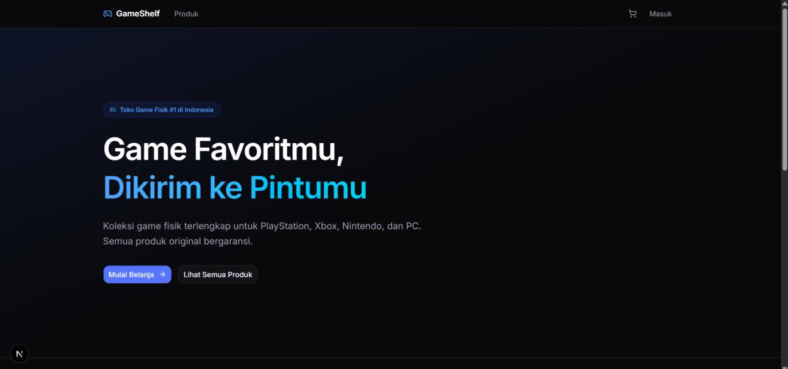
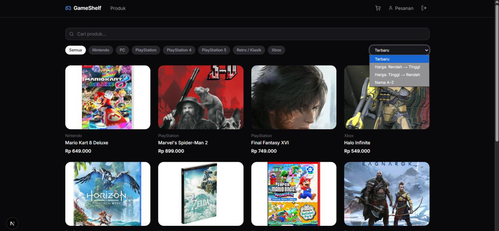
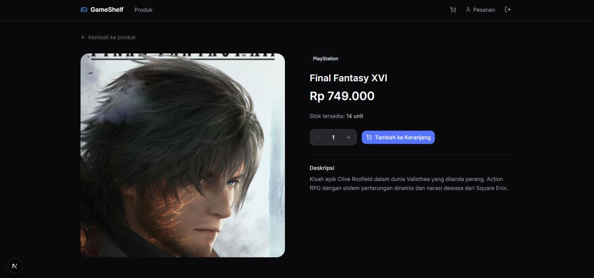
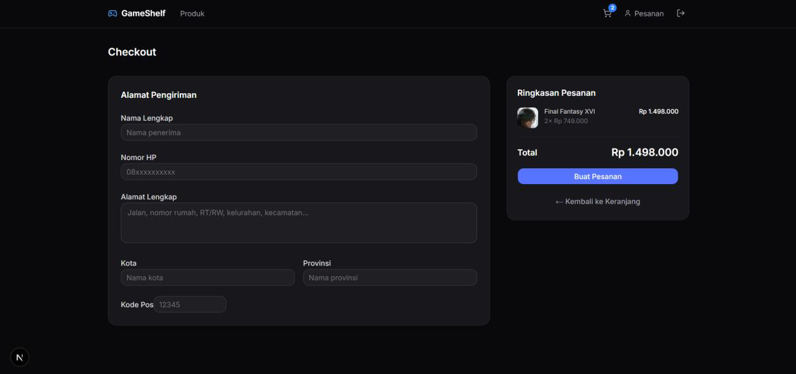
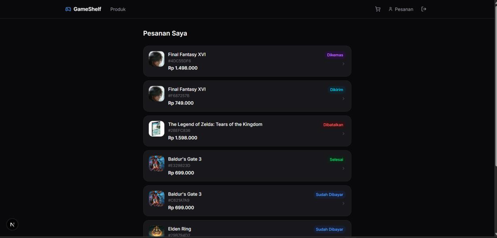
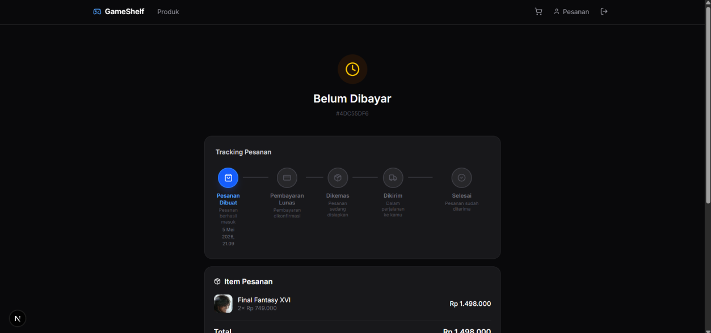
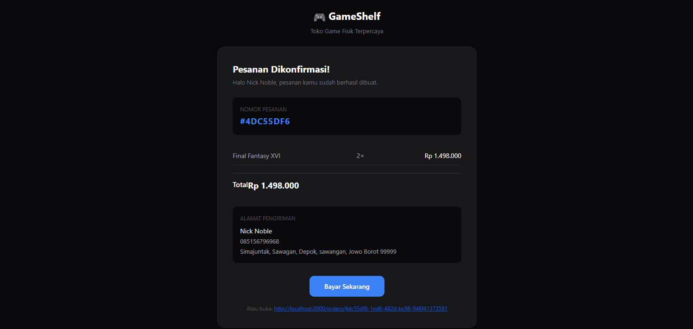
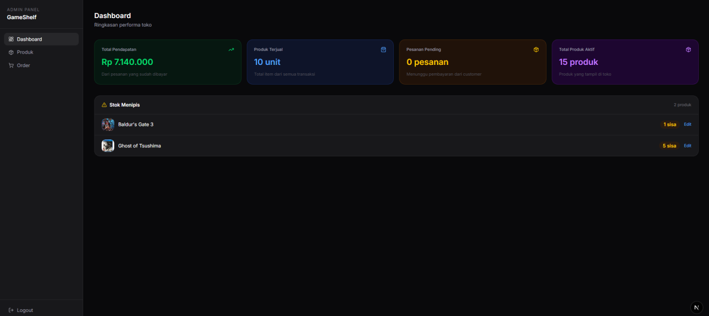
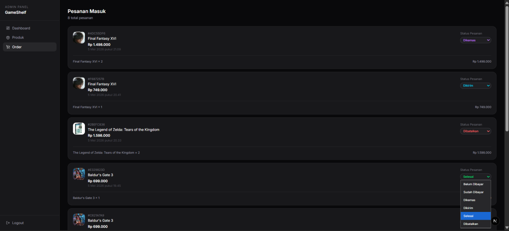
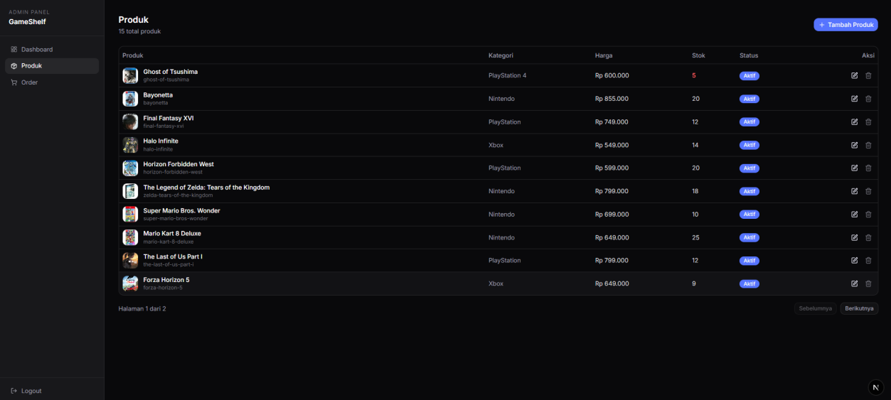

<div align="center">

# 🎮 GameShelf

**Toko online game fisik original untuk gamer Indonesia.**

PlayStation · Xbox · Nintendo · PC — terkurasi, original, bergaransi.

[](https://nextjs.org/)
[](https://www.typescriptlang.org/)
[](https://supabase.com/)
[](https://tailwindcss.com/)
[](https://midtrans.com/)
[](LICENSE)



</div>

---

## ✨ Tentang

**GameShelf** adalah platform e-commerce yang fokus menjual **game fisik original** ke gamer dan kolektor di seluruh Indonesia. Marketplace umum penuh barang KW dan toko fisik makin sedikit — GameShelf hadir sebagai satu tempat yang dirancang khusus untuk segmen ini: katalog terkurasi, pembayaran aman, dan tracking pesanan transparan.

Project ini dibangun sebagai studi kasus end-to-end e-commerce modern: dari katalog produk dengan filter, checkout multi-tahap, integrasi pembayaran Midtrans, sampai admin panel untuk mengelola stok dan status pesanan secara realtime.

---

## 🚀 Fitur Utama

### 🛒 Untuk Pembeli
- **Katalog terkurasi** dengan filter kategori (PS5, Xbox, Switch, PC) & sorting
- **Halaman detail produk** lengkap dengan stok realtime
- **Keranjang belanja** dengan state global (Zustand) yang persistent
- **Checkout multi-step** dengan validasi alamat (React Hook Form + Zod)
- **Pembayaran Midtrans**: Virtual Account, QRIS, GoPay, kartu kredit
- **Email konfirmasi otomatis** via Resend setelah order & setelah pembayaran sukses
- **Tracking pesanan 5 tahap**: Dibuat → Dibayar → Dikemas → Dikirim → Selesai
- **Update status realtime** via Supabase WebSocket (tanpa refresh)

### 🛠️ Untuk Admin
- **Dashboard performa**: pendapatan, produk terjual, peringatan stok menipis
- **CRUD produk** dengan upload gambar ke Supabase Storage
- **Manajemen pesanan** dengan filter berdasarkan status pembayaran/pengiriman
- **Update status pesanan** yang langsung tersinkron ke akun customer
- **Auth terpisah** dari customer dengan role guard di middleware

---

## 📸 Screenshots

### Landing & Katalog
<table>
  <tr>
    <td width="50%"><p align="center"><sub>Landing page</sub></p></td>
    <td width="50%"><p align="center"><sub>Katalog dengan filter</sub></p></td>
  </tr>
</table>

### Detail Produk & Checkout
<table>
  <tr>
    <td width="50%"><p align="center"><sub>Halaman detail produk</sub></p></td>
    <td width="50%"><p align="center"><sub>Form checkout</sub></p></td>
  </tr>
</table>

### Pembayaran & Tracking
<table>
  <tr>
    <td width="50%"><p align="center"><sub>Pembayaran via Midtrans</sub></p></td>
    <td width="50%"><p align="center"><sub>Tracking 5 tahap</sub></p></td>
  </tr>
</table>

### Email Notifikasi
<p align="center">
  
  <br/><sub>Email konfirmasi otomatis via Resend</sub>
</p>

### Admin Panel
<table>
  <tr>
    <td width="50%"><p align="center"><sub>Dashboard performa</sub></p></td>
    <td width="50%"><p align="center"><sub>Kelola pesanan & status</sub></p></td>
  </tr>
</table>
<p align="center">
  
  <br/><sub>CRUD produk</sub>
</p>

---

## 🧱 Tech Stack

### Frontend
| Tech | Kegunaan |
|------|----------|
| **Next.js 14 (App Router)** | Framework React dengan Server Components & API Routes |
| **TypeScript** | Type safety end-to-end |
| **Tailwind CSS** | Styling utility-first |
| **shadcn/ui** | Komponen UI yang konsisten & accessible |
| **Zustand** | State management untuk cart |
| **React Hook Form + Zod** | Form handling & validasi schema |

### Backend & Real-Time
| Tech | Kegunaan |
|------|----------|
| **Supabase PostgreSQL** | Database utama |
| **Supabase Auth** | Autentikasi customer & admin (role-based) |
| **Supabase Realtime** | WebSocket untuk update status pesanan live |
| **Supabase Storage** | Penyimpanan gambar produk |

### Payment & Notifications
| Tech | Kegunaan |
|------|----------|
| **Midtrans** | Payment gateway (sandbox gratis untuk development) |
| **Resend** | Email transaksional (konfirmasi order & pembayaran) |

---

## 🏗️ Arsitektur

```
┌─────────────────────────┐         ┌─────────────────────────┐
│   Customer Web App      │         │      Admin Panel        │
│  (landing, katalog,     │         │  (dashboard, produk,    │
│  checkout, tracking)    │         │   pesanan, status)      │
└───────────┬─────────────┘         └───────────┬─────────────┘
            │                                   │
            └─────────────┬─────────────────────┘
                          │  HTTPS · Realtime WebSocket
                          ▼
┌─────────────────────────────────────────────────────────────┐
│                      Next.js (App Router)                   │
│        Server Components · API Routes · Middleware          │
└─────────────────────────────┬───────────────────────────────┘
                              │  Supabase Client SDK
                              ▼
┌─────────────────────────────────────────────────────────────┐
│                          Supabase                           │
│   Postgres  ·  Auth  ·  Realtime (WS)  ·  Storage           │
└─────────────────────────────────────────────────────────────┘
                              │
              ┌───────────────┴───────────────┐
              ▼                               ▼
      ┌──────────────┐                ┌──────────────┐
      │   Midtrans   │                │    Resend    │
      │   (payment)  │                │    (email)   │
      └──────────────┘                └──────────────┘
```

---

## 🛠️ Getting Started

### Prerequisites
- Node.js 18+
- pnpm / npm / yarn
- Akun [Supabase](https://supabase.com/) (free tier cukup)
- Akun [Midtrans](https://midtrans.com/) (sandbox gratis)
- Akun [Resend](https://resend.com/) (free tier)

### Instalasi

```bash
# 1. Clone repo
git clone https://github.com/<your-username>/gameshelf.git
cd gameshelf

# 2. Install dependencies
pnpm install

# 3. Setup environment variables
cp .env.example .env.local
```

### Environment Variables

Isi `.env.local` dengan kredensial kamu:

```env
# Supabase
NEXT_PUBLIC_SUPABASE_URL=https://xxxx.supabase.co
NEXT_PUBLIC_SUPABASE_ANON_KEY=xxxx
SUPABASE_SERVICE_ROLE_KEY=xxxx

# Midtrans (Sandbox)
NEXT_PUBLIC_MIDTRANS_CLIENT_KEY=SB-Mid-client-xxxx
MIDTRANS_SERVER_KEY=SB-Mid-server-xxxx
MIDTRANS_IS_PRODUCTION=false

# Resend
RESEND_API_KEY=re_xxxx
RESEND_FROM_EMAIL=noreply@yourdomain.com

# App
NEXT_PUBLIC_APP_URL=http://localhost:3000
```

### Database Setup

```bash
# Jalankan migration di Supabase
pnpm supabase db push

# (Opsional) seed data dummy
pnpm db:seed
```

### Run

```bash
# Development
pnpm dev

# Build production
pnpm build && pnpm start
```

Buka [http://localhost:3000](http://localhost:3000) di browser.

---

## 📂 Struktur Project

```
gameshelf/
├── app/
│   ├── (shop)/              # Route group: customer-facing
│   │   ├── page.tsx         # Landing
│   │   ├── products/        # Katalog & detail
│   │   ├── cart/            # Keranjang
│   │   ├── checkout/        # Checkout flow
│   │   └── orders/          # Tracking pesanan
│   ├── (admin)/             # Route group: admin
│   │   ├── dashboard/
│   │   ├── products/        # CRUD produk
│   │   └── orders/          # Kelola pesanan
│   ├── api/
│   │   ├── midtrans/        # Webhook & create transaction
│   │   └── email/           # Resend trigger
│   └── layout.tsx
├── components/
│   ├── ui/                  # shadcn/ui components
│   └── shop/                # Custom shop components
├── lib/
│   ├── supabase/            # Client & server helpers
│   ├── midtrans/            # Midtrans SDK wrapper
│   └── validators/          # Zod schemas
├── stores/                  # Zustand stores (cart)
├── public/
└── docs/                    # Screenshots untuk README
```

---

## 🗺️ Roadmap

- [x] MVP: katalog, checkout, payment, admin panel
- [x] Realtime status update via WebSocket
- [x] Email notifikasi otomatis
- [ ] Pre-order untuk rilis baru
- [ ] Sistem trade-in game bekas
- [ ] Wishlist & notifikasi stok
- [ ] Integrasi multi-kurir (JNE, J&T, SiCepat)
- [ ] Program membership & loyalty points
- [ ] Mobile app native (React Native)

---

## 👤 Author

**Girindra Sulistiyo Wardoyo**
Founder & Developer · GameShelf

---

## 📄 License

MIT © 2026 Girindra Sulistiyo Wardoyo

---

<div align="center">
  <sub>Built with ❤️ for the Indonesian gaming community.</sub>
</div>
